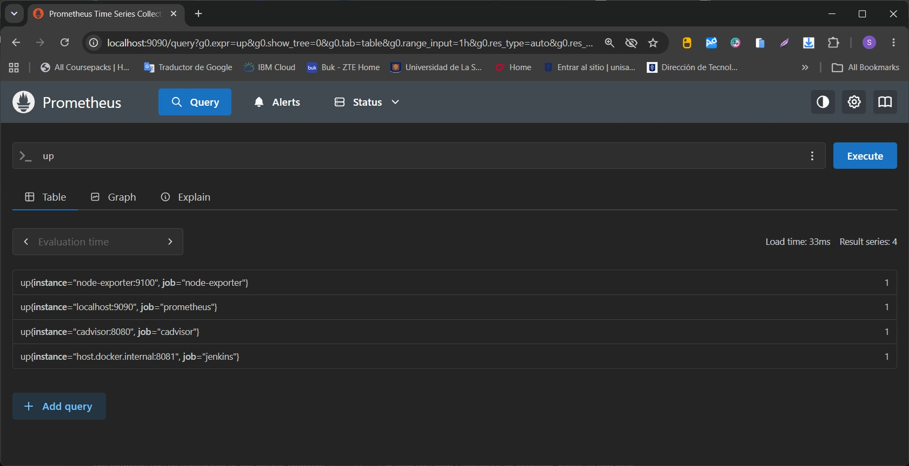
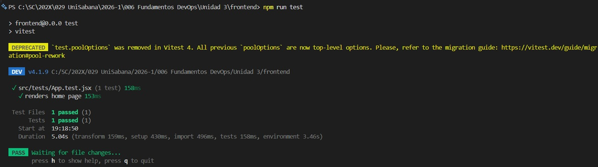

# DevOps React Lab

## Fundamentos DevOps - Unidad 3

### Integración Continua (CI), Calidad de Código y Observabilidad

---

## Autor

**Sergio Cruz**

Universidad de La Sabana

---

# Descripción

Este proyecto implementa una aplicación desarrollada con **React + Vite** y un flujo completo de **DevOps**, integrando herramientas de Integración Continua (CI), análisis estático de código, pruebas automatizadas y monitoreo de infraestructura.

El objetivo principal es automatizar el ciclo de construcción y validación del software desde cada cambio realizado en el repositorio hasta el monitoreo de la infraestructura donde se ejecuta.

---

# Objetivos

* Automatizar el proceso de construcción mediante GitHub Actions.
* Ejecutar pruebas unitarias automáticamente.
* Medir la cobertura del código.
* Integrar SonarQube para análisis de calidad.
* Construir la aplicación automáticamente.
* Generar artefactos de despliegue.
* Configurar Jenkins como servidor de automatización.
* Implementar monitoreo mediante Prometheus y Grafana.
* Visualizar métricas de infraestructura y contenedores Docker.

---

# Arquitectura

```text
                   GitHub Repository
                          │
                          │ Push / Pull Request
                          ▼
                 GitHub Actions (CI)
                          │
        ┌─────────────────┼─────────────────┐
        │                 │                 │
        ▼                 ▼                 ▼
  npm install      Unit Tests        Code Coverage
        │
        ▼
 SonarQube Analysis
        │
        ▼
   React Build
        │
        ▼
 Upload Artifact
        │
        ▼
      Jenkins
        │
        ▼
──────────────────────────────────────────────
                Observabilidad
──────────────────────────────────────────────

Node Exporter ─┐
               │
cAdvisor ──────┼────► Prometheus ─────► Grafana
               │
Jenkins ───────┘
```

---

# Tecnologías utilizadas

| Herramienta    | Propósito                |
| -------------- | ------------------------ |
| React          | Frontend                 |
| Vite           | Build Tool               |
| Vitest         | Pruebas unitarias        |
| GitHub Actions | Integración Continua     |
| Jenkins        | Automatización           |
| SonarQube      | Calidad del código       |
| Docker         | Contenedores             |
| Docker Compose | Orquestación             |
| Prometheus     | Recolección de métricas  |
| Grafana        | Visualización            |
| Node Exporter  | Métricas del sistema     |
| cAdvisor       | Métricas de contenedores |

---

# Estructura del proyecto

```text
DevOps-U3/

│
├── .github/
│   └── workflows/
│       └── ci.yml
│
├── src/
│
├── public/
│
├── coverage/
│
├── docker-compose.yml
│
├── prometheus/
│   └── prometheus.yml
│
├── sonar-project.properties
│
├── package.json
│
├── vite.config.js
│
└── README.md
```

---

# Pipeline CI

El pipeline ejecuta automáticamente las siguientes etapas:

1. Checkout del repositorio.
2. Instalación de dependencias.
3. Ejecución de pruebas unitarias.
4. Generación de cobertura.
5. Construcción de la aplicación.
6. Análisis de calidad mediante SonarQube.
7. Publicación del artefacto generado.

---

## GitHub Actions

Workflow:

```text
.github/workflows/ci.yml
```

Etapas principales:

* Checkout repository
* Setup Node
* npm install
* npm run coverage
* npm run build
* SonarQube Analysis
* Upload Artifact

---

# Pruebas unitarias

Framework utilizado:

* Vitest
* Testing Library

Ejecución:

```bash
npm run coverage
```

Resultados:

* Ejecución automática desde GitHub Actions.
* Reporte de cobertura generado.
* Archivo lcov.info utilizado por SonarQube.

---

# Calidad del código

Se integró SonarQube para realizar análisis estático del proyecto.

Se evaluaron:

* Bugs
* Vulnerabilidades
* Code Smells
* Cobertura
* Duplicación

Archivo utilizado:

```text
sonar-project.properties
```

---

# Jenkins

Jenkins fue configurado como servidor de automatización para ejecutar pipelines de integración continua.

Características:

* Pipeline automatizado.
* Ejecución de Builds.
* Integración con Docker.
* Exportación de métricas hacia Prometheus.

---

# Docker

Servicios desplegados mediante Docker Compose.

Servicios incluidos:

* Jenkins
* SonarQube
* Prometheus
* Grafana
* Node Exporter
* cAdvisor

Inicio del entorno:

```bash
docker compose up -d
```

Visualización:

```bash
docker ps
```

---

# Observabilidad

## Prometheus

Prometheus recopila métricas provenientes de:

* Prometheus
* Node Exporter
* cAdvisor
* Jenkins

Consulta básica:

```text
up
```

---

## Grafana

Se configuró Grafana conectado a Prometheus.

Dashboards implementados:

* Node Exporter Full
* cAdvisor Exporter
* Prometheus 2.0 Overview

Estos dashboards permiten visualizar:

* CPU
* Memoria
* Disco
* Red
* Contenedores Docker
* Estado del servidor
* Estado de Prometheus

---

# Ejecución local

Instalar dependencias

```bash
npm install
```

Ejecutar la aplicación

```bash
npm run dev
```

Ejecutar pruebas

```bash
npm run coverage
```

Construcción

```bash
npm run build
```

---

# Flujo CI/CD

```text
Developer
     │
     ▼
Git Push
     │
     ▼
GitHub Repository
     │
     ▼
GitHub Actions
     │
     ├── npm install
     ├── Unit Tests
     ├── Coverage
     ├── SonarQube Analysis
     ├── Build
     ▼
Artifacts
     │
     ▼
Jenkins
     │
     ▼
Prometheus
     │
     ▼
Grafana
```

---

# Resultados obtenidos

Se logró implementar satisfactoriamente:

* Integración Continua mediante GitHub Actions.
* Automatización con Jenkins.
* Pruebas unitarias automatizadas.
* Reportes de cobertura.
* Análisis estático mediante SonarQube.
* Construcción automática del proyecto.
* Publicación de artefactos.
* Infraestructura basada en Docker.
* Recolección de métricas con Prometheus.
* Visualización mediante Grafana.

---

# Conclusiones

Este laboratorio permitió integrar múltiples herramientas del ecosistema DevOps dentro de un flujo automatizado de desarrollo.

La automatización mediante GitHub Actions y Jenkins garantiza la validación continua del código fuente, mientras que SonarQube aporta control sobre la calidad del software. Finalmente, Prometheus y Grafana proporcionan una solución de observabilidad que permite monitorear en tiempo real tanto la infraestructura como los servicios desplegados.

La integración de estas herramientas demuestra cómo las prácticas DevOps contribuyen a mejorar la calidad del software, reducir errores manuales y aumentar la visibilidad sobre el estado de las aplicaciones.

---

# Evidencias 

Capturas de pantalla :

* Repositorio GitHub.

[Repositorio GitHub](./docs/images/GitHub%20Actions.jpg)


* Runner Self-Hosted en ejecución.

[Self-Hosted Runner](./docs/images/Runner%20Self-Hosted.jpg)


* Dashboard de SonarQube.

[Dashboard SonarQube 1](./docs/images/sonarqube%201.jpg)


[Dashboard SonarQube 2](./docs/images/sonarqube%202.jpg)


* Jenkins.

[Jenkins 1](./docs/images/Jenkins%201.jpg)


[Jenkins 2](./docs/images/Jenkins%202.jpg)


* Docker Desktop con los contenedores.

[Docker Desktop](./docs/images/Docker%20Desktop.jpg)


* Prometheus mostrando la consulta `up`.

[Prometheus](./docs/images/Prometheus.jpg)


* Dashboards de Grafana.

[Dashboard de Grafana 1](./docs/images/Grafana%201.jpg)


[Dashboard de Grafana 2](./docs/images/Grafana%202.jpg)


[Dashboard de Grafana 3](./docs/images/Grafana%203.jpg)


* Reporte de cobertura generado por Vitest.

[Vitest](./docs/images/vitest.jpg)

